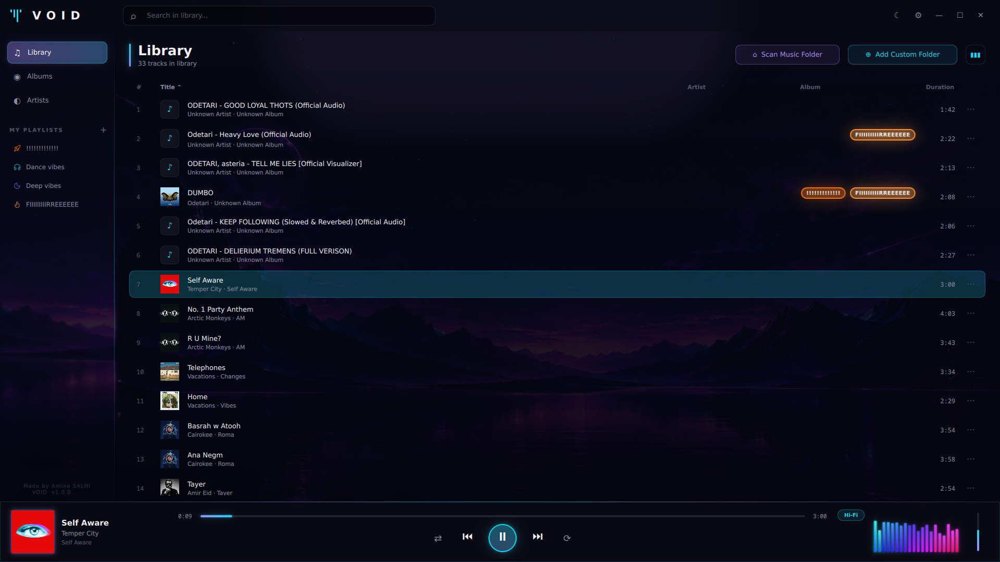
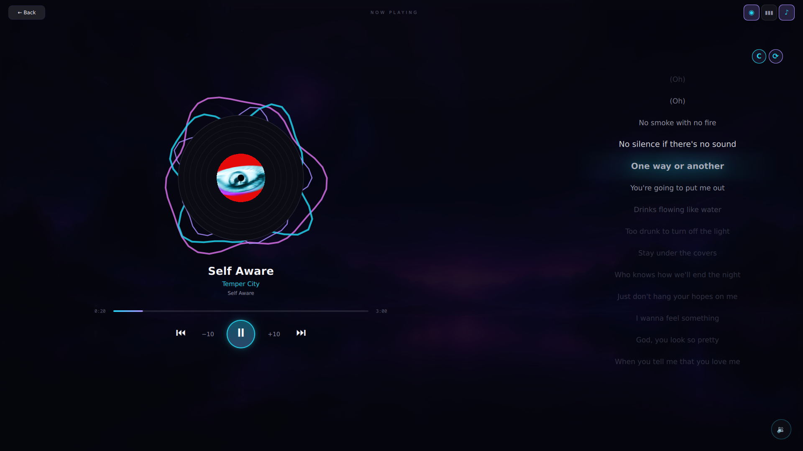
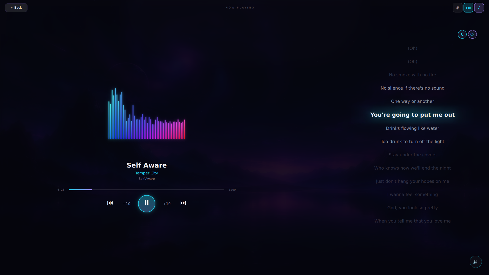
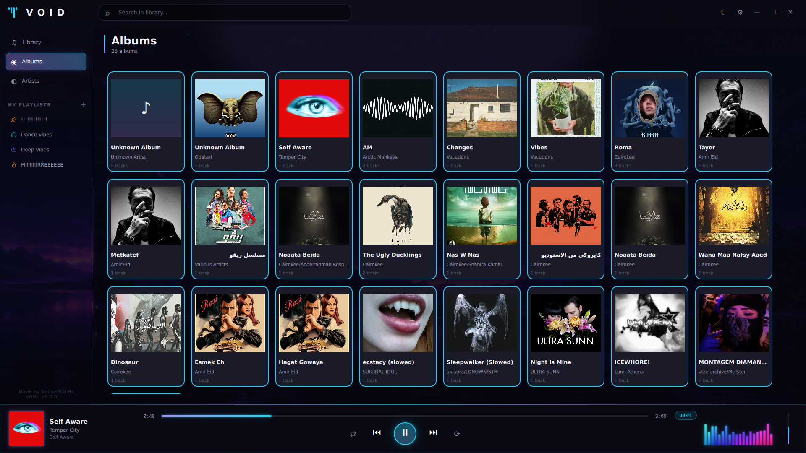
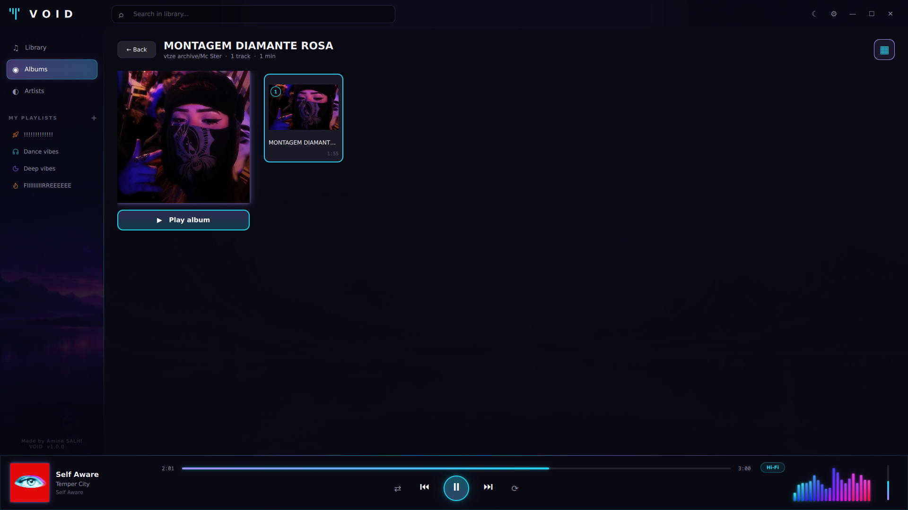
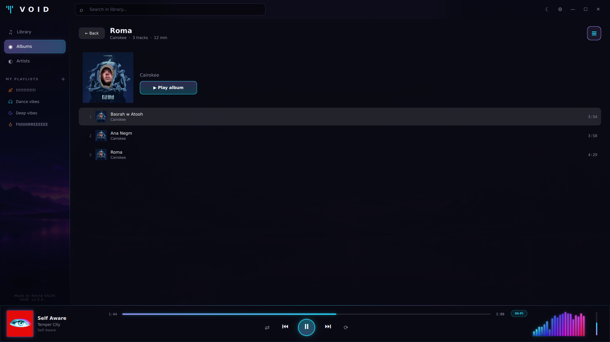
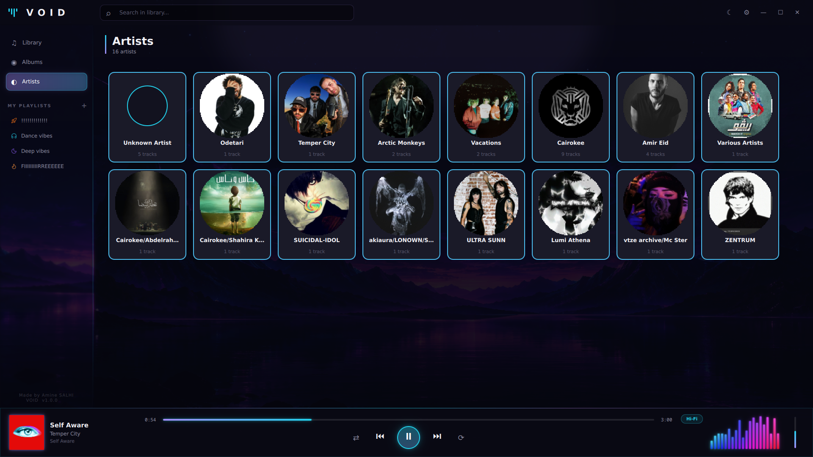
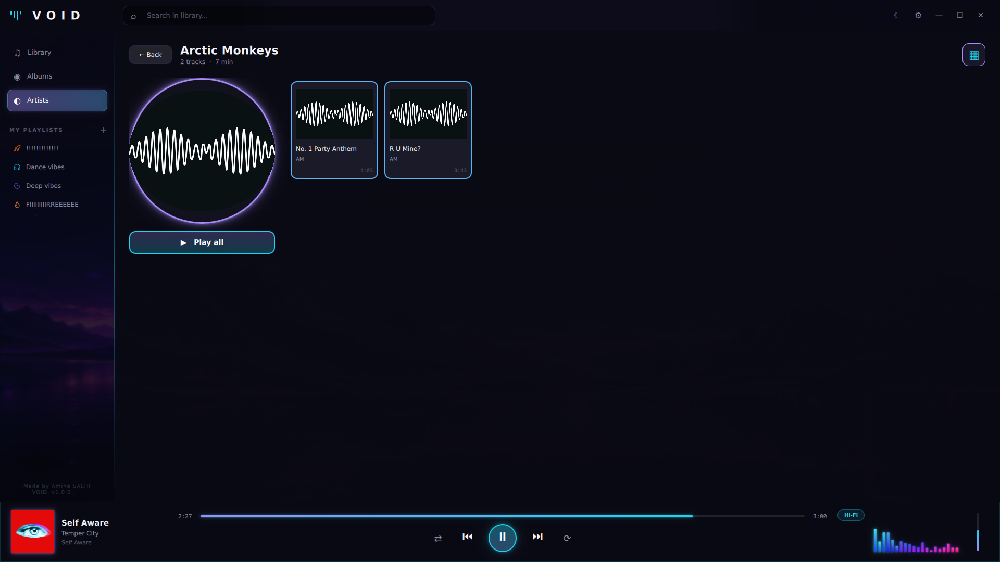
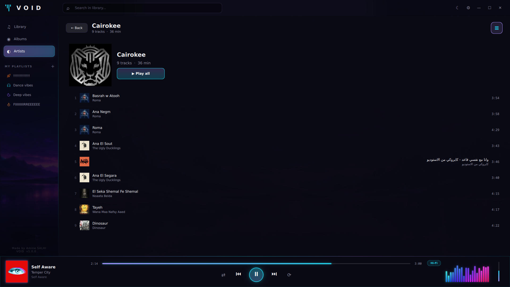
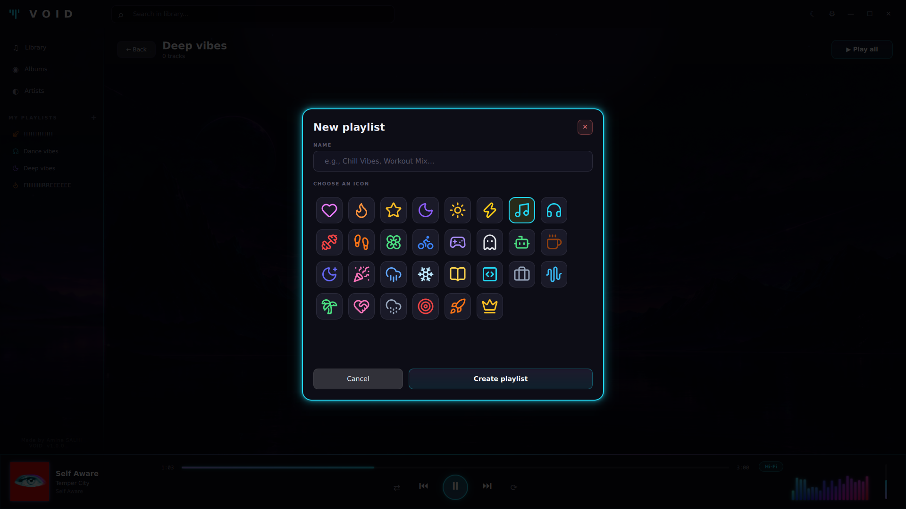

<div align="center">

#  VOID

### A modern, native music player — built for people who love their library.


**Fast. Beautiful. Yours.**

VOID is a from-scratch, native music player with a focus on speed, aesthetics, and the small details that make listening a joy.

</div>

---

## ✨ Features

### 🎵 Playback
- **Native audio** via Qt6 Multimedia + FFmpeg
- **Gapless-feel** transitions
- **Seek, skip, volume** — full keyboard control
- **Restore last session** — pick up where you left off
- **Smart queue** — playlist playback stays within the playlist

### 📚 Library
- **Instant scanning** of `~/Music` or any folder
- **SQLite-backed** — loads 1000s of tracks in milliseconds
- **Rich metadata** — title, artist, album, year, cover art (via TagLib)
- **Album & Artist views** with grid layouts
- **Search** across title / artist / album

### 🎨 Design
- **Custom neon theme** — cyan, purple, magenta
- **Animated visualizers** — bars + vinyl disc
- **Glowing accents** everywhere
- **Smooth transitions** between pages
- **Built for dark mode**

### 📝 Lyrics
- **Auto-fetched** from LRCLIB
- **Synced lyrics** — current line highlighted with neon glow
- **Click-to-seek** — click any line, jump to that moment
- **Local cache** — no repeated network calls

### 🎧 Playlists
- **Create, rename, delete** — full management
- **30 neon SVG icons** to personalize each playlist
- **Add/remove tracks** with a single click
- **Glowing badges** show which playlists a track belongs to
- **Playlist-scoped queue** — next/prev stays inside

### ⌨️ Keyboard Shortcuts
| Key | Action |
|---|---|
| `Space` | Play / Pause |
| `←` / `→` | Seek ±5s |
| `← ←` / `→ →` | Previous / Next track |
| `↑` / `↓` | Volume ±5% |
| `Ctrl + ← / →` | Seek ±30s |
| `M` | Mute |
| `L` | Toggle lyrics |
| `N` | Now Playing view |
| `/` | Focus search |
| `1 / 2 / 3` | Library / Albums / Artists |
| `Esc` | Back / close / clear |
| `F11` | Fullscreen |
| `Ctrl + Q` | Quit |

---

## 🚀 Install

### 📦 Platforms

| Platform | Status | Notes |
|---|---|---|
| 🐧 **Linux** | ✅ **Stable** | Primary target — full feature set |
| 🪟 **Windows** | 🚧 **In progress** | Build system ready, native packaging coming |
| 📱 **Android** | 🚧 **Planned** | Same QML UI, native MediaStore integration |
| 🍎 **macOS** | 💭 **Under consideration** | Same codebase, needs testing |

---

### 🐧 Linux (source build)

**Requirements:**
- Qt 6.5+
- CMake 3.21+
- TagLib 2.x
- A C++20 compiler (GCC 12+, Clang 15+)

```bash
# Clone
git clone https://github.com/aminesalhi77/VOID_Player.git
cd VOID_Player

# Build
cmake -B build -G Ninja
cmake --build build

# Install (optional)
cp build/void ~/.local/bin/void

# Run
./build/void
```

### 🪟 Windows (source build)

**Requirements:**
- Visual Studio 2022 (or MinGW)
- Qt 6.5+ for Windows
- CMake 3.21+
- TagLib 2.x

```powershell
# Clone
git clone https://github.com/aminesalhi77/VOID_Player.git
cd VOID_Player

# Configure (adjust Qt path)
cmake -B build -G "Visual Studio 17 2022" `
  -DCMAKE_PREFIX_PATH="C:/Qt/6.8.0/msvc2022_64"

# Build
cmake --build build --config Release

# Run
.\build\Release\void.exe
```

> ⚠️ Windows support is actively being worked on. Native `.exe` installer coming soon.

### 📱 Android (planned)

Android support is on the roadmap. The QML UI is portable — main work is:
- MediaStore integration for library scanning
- Background playback service
- Runtime permission handling

> Follow the repo to get notified when the first Android build is available.

---

### First run
VOID will automatically:
1. Create a local SQLite database at `~/.local/share/VOID/VOID/library.db` (Linux) or `%APPDATA%\VOID\VOID\library.db` (Windows)
2. Scan `~/Music` (Linux) or `%USERPROFILE%\Music` (Windows) for audio files
3. Fetch lyrics and artist images in the background

You can also **Add Custom Folder** from the Library view.

---

## 🖼️ Screenshots

<div align="center">

### 🏠 Main Library


### 🎵 Now Playing — Vinyl Mode


### 🎶 Now Playing — Bars Mode


### 💿 Albums


<table>
<tr>
<td width="50%">

**Albums — list view**


</td>
<td width="50%">

**Albums — detail**


</td>
</tr>
</table>

### 🎤 Artists


<table>
<tr>
<td width="50%">

**Artists — list view**


</td>
<td width="50%">

**Artists — detail**


</td>
</tr>
</table>

### ➕ Create Playlist


</div>

---

## 🛠️ Architecture

Built on **Qt 6 + QML** — a single codebase for Linux, Windows, and (soon) Android.

```
void/
├── src/
│   ├── library/        # SQLite-backed music library
│   │   ├── Library     # QML-facing facade
│   │   ├── LibraryDb   # Database layer (tracks, lyrics, playlists)
│   │   └── Track       # Track struct
│   ├── metadata/       # TagLib wrapper for audio tags
│   ├── models/         # QAbstractListModel for the QML view
│   ├── player/         # Playback, audio analyzer, fetchers
│   │   ├── Playback
│   │   ├── AudioAnalyzer       # FFT for visualizers
│   │   ├── LyricsFetcher       # LRCLIB client
│   │   └── ArtistImageFetcher
│   └── main.cpp
├── qml/
│   ├── Main.qml                # Root window + shortcuts
│   ├── components/
│   │   ├── AlbumDetail.qml
│   │   ├── ArtistDetail.qml
│   │   ├── LyricsPanel.qml
│   │   ├── LyricsSyncDialog.qml
│   │   └── PlaylistManager.qml
│   ├── assets/
│   │   ├── icons/playlists/    # 30 Lucide SVGs
│   │   └── background/
│   └── theme/Theme.qml         # Colors + typography
└── CMakeLists.txt
```

---

## 🎨 Tech Stack

| Layer | Tech |
|---|---|
| **UI** | Qt Quick / QML, Qt Quick Controls 2, MultiEffect |
| **Logic** | C++20, Qt6 Core |
| **Audio** | Qt6 Multimedia (FFmpeg backend) |
| **Metadata** | TagLib |
| **Storage** | SQLite (via QtSql) |
| **Lyrics** | LRCLIB API |
| **Icons** | Lucide (MIT) |

---

## 🗺️ Roadmap

### ✅ Done
- [x] Core playback + library
- [x] Synced lyrics with auto-fetch
- [x] User playlists with custom icons
- [x] Keyboard shortcuts
- [x] Neon theme

### 🚧 In Progress
- [ ] **Windows build** — native installer + media keys (SMTC)
- [ ] **Android port** — MediaStore + background service
- [ ] MPRIS / global media keys (Linux)
- [ ] Crossfade + gapless playback

### 💭 Planned
- [ ] Equalizer
- [ ] Last.fm scrobbling
- [ ] Chromecast / DLNA
- [ ] Whisper-based lyrics auto-timing
- [ ] **macOS build**

### 🎯 Long-term
- [ ] Auto-update system
- [ ] Music visualizer modes (radial, waveform, particles)
- [ ] Theme system (multiple color schemes)
- [ ] Discord Rich Presence

---

## 📜 License

MIT — see [LICENSE](LICENSE) for details.

---

## 👤 Author

**Amine SALHI**

Made with obsession over small details, in dark mode, late at night.

---

<div align="center">

**🌑 VOID** — because your music deserves a home that feels right.

</div>
